# Trampolean Image and Video Generator

Gera um reel vertical 9:16 (TikTok, Reels, Shorts) com a cara da sua marca, conversando com o
Jotaro: agente de IA e membro do time da Trampolean dentro do Claude Code. Você descreve o que
quer, o Jotaro roteiriza junto com você, te mostra o caminho e as cenas antes de gerar 1 crédito,
e só então produz o reel montado.

> Geração de imagem e vídeo via **Higgsfield**. Montagem via **FFmpeg**.
> `[uso de IA]` Este produto usa IA para gerar imagens e vídeos.

## Modelos e custos

Há **dois tipos de modelo** aqui, e dois tipos de custo — não confunda:

- O **modelo Claude** que roda o Jotaro (a conversa/orquestração) → custo em **tokens do Claude**.
- O **modelo Higgsfield** que gera a imagem/vídeo → custo em **créditos do Higgsfield**.

### 1. Modelo Claude recomendado (roda o Jotaro)

| Modelo Claude | Esforço (reasoning) | Roda o Jotaro? |
|---------------|---------------------|----------------|
| **Opus** | médio ou superior | ✅ recomendado |
| **Sonnet** | alto ou superior | ✅ funciona |
| **Haiku** | — | ❌ sem capacidade de rodar |

A orquestração é pesada (10 gates de qualidade, 4 subagentes, travas mecânicas, controle de
escopo, retomada de checkpoint). Abaixo do esforço recomendado, o modelo perde o fio, pula etapa
ou alucina — por isso o Haiku não dá conta e o Sonnet precisa de esforço alto.

### 2. Uso de Claude por fluxo completo (estimativa)

> **Estimativa, não medida.** Varia bastante com o tamanho da conversa, o número de cenas e as
> retentativas. Base: o system prompt do Jotaro tem ~12k tokens (carregado a cada turno), e um
> fluxo completo leva ~30–50 turnos + 4 subagentes. A **contagem de tokens é ~igual entre Opus e
> Sonnet**; o que muda é o preço por token (Opus > Sonnet) e a qualidade da condução. Confira o
> preço atual na tabela da Anthropic.

| Cenário | Tokens de entrada | Tokens de saída |
|---------|-------------------|-----------------|
| **Do absoluto 0** (montar a marca + gerar tudo) | ~1,0–1,5 M | ~60–100 k |
| **Com as referências prontas** (modo biblioteca) | ~0,7–1,2 M | ~50–80 k |

### 3. Créditos Higgsfield por modelo de geração

Custos **reais** consultados via `higgsfield generate cost` (2026-06-26; são custo-base, podem
variar com resolução/params e mudar com o tempo — reconfirme com o comando). Exemplo: **reel de 6
cenas**. "Do absoluto 0" = você gera as 6 imagens (modo geração); "com referências" = imagem 0
(modo biblioteca, é seleção), só o vídeo conta.

**Modelos de imagem** (custo por imagem · reel de 6, modo geração):

| Modelo | cr/imagem | 6 imagens (do 0) |
|--------|-----------|------------------|
| `nano_banana_2` (Nano Banana Pro, **default**) | 2 | 12 |
| `cinematic_studio_2_5` | 2 | 12 |
| `nano_banana_flash` | 1,5 | 9 |
| `nano_banana` | 1 | 6 |
| `flux_2` | 1 | 6 |
| `seedream_v4_5` | 1 | 6 |
| `ms_image` | 0,5 | 3 |
| `soul_cinematic` | 0,12 | 0,72 |
| `text2image_soul_v2` (Higgsfield Soul V2) | 0,12 | 0,72 |

**Modelos de vídeo** (custo por clipe 4s · reel de 6 = 6 clipes):

| Modelo | cr/clipe (4s) | 6 clipes |
|--------|---------------|----------|
| `veo3_1_lite` (Veo 3.1 Lite, **default free**) | 4 | 24 |
| `kling3_0` | 8 | 48 |
| `veo3_1` | 11 | 66 |
| `seedance_2_0` | 18 | 108 |
| `cinematic_studio_3_0` | 20 | 120 |
| `marketing_studio_video` | 20 | 120 |

**Total do fluxo no caminho default** (`nano_banana_2` + `veo3_1_lite`):

| Cenário | Imagem | Vídeo | **Total** |
|---------|--------|-------|-----------|
| **Do absoluto 0** (modo geração) | 12 | 24 | **36 créditos** |
| **Com as referências** (modo biblioteca) | 0 | 24 | **24 créditos** |

> Em modo biblioteca o custo de imagem é **0 com qualquer modelo** (é seleção de asset), então só o
> modelo de **vídeo** muda o total. No plano free são 10 créditos/dia, então um reel completo sai
> aos poucos ou num plano pago.

## Pré-requisitos

1. **Claude Code** instalado, num computador com tela e navegador (o login do Higgsfield abre
   uma página no navegador, não funciona em servidor sem interface).
2. **Conta Higgsfield** (o serviço que gera as imagens e vídeos). O plano free dá 10 créditos
   por dia. https://higgsfield.ai
3. **Higgsfield CLI** (`npm install -g @higgsfield/cli`), o jeito recomendado pra Claude Code.
   O `/setup` instala e conecta pra você.
4. **FFmpeg** instalado (monta o reel final). Como instalar está no `/setup`.

## Primeiro uso

1. **Baixe ou clone esta pasta.**
2. **Abra o Claude Code dentro da pasta** (com interface gráfica, não terminal puro). Ao abrir,
   o **Jotaro** já está lá: é o agente de IA da Trampolean com quem você fala.
3. **Rode `/setup`.** Ele instala o Higgsfield CLI (se preciso), conduz o login no navegador
   (`higgsfield auth login`, você só aprova na conta certa), e confere o FFmpeg e o saldo.
**Não precisa reiniciar o Claude Code**: a auth do CLI vale na mesma sessão.
4. **Rode `/creditos`** para confirmar a conta conectada (email + saldo) e ver seu crédito.

Pronto isso uma vez, não precisa repetir. O login fica guardado no seu perfil. Se você trocar
de conta no Higgsfield, é só pedir pro Jotaro reconectar (`higgsfield auth login`). Ele
resolve na hora, sem reiniciar.

## Como funciona, em duas fases

O gerador trabalha em duas fases bem separadas, e a primeira existe justamente pra você não
gastar crédito no escuro.

**Etapa 1, Roteirização (custo zero).** Antes de qualquer geração, o Jotaro conduz uma
**roteirização guiada**. Ele coleta o que precisa saber (a intake), escreve um roteiro com você,
e desenha as cenas. Nada é gerado e nada é cobrado nesta fase. O objetivo é simples: você
praticamente visualiza o resultado antes de o primeiro crédito ser tocado. Tem **dois pontos de
aprovação** no caminho: depois do roteiro e depois das cenas. Sem os dois "sim", a produção não
começa.

**Etapa 2, Produção (custo em créditos).** Com o roteiro e as cenas aprovados, o Jotaro gera as
imagens, anima cada uma em clipe, e monta o reel 9:16. Cada disparo aqui consome crédito, e o
Jotaro sempre confere o custo e o saldo antes.

O fluxo completo da Etapa 1, do começo à produção:

```
intake → [pesquisa-web (opcional) → {tema, tendências, público-alvo}] → rag
       → story-writer → 🚦 aprovação 1 (roteiro) → storyboard-director
       → 🚦 aprovação 2 (cenas) → prompt-smith → shot-list → ETAPA 2 (produção)
```

### A intake guiada (`/roteiro`)

A intake é a porta de entrada. O Jotaro pergunta só as lacunas que faltam (projeto, plataforma,
objetivo do post, tipo de conteúdo), uma de cada vez, e grava cada resposta em disco
(`projects/<nome>/output/.intake-state.json`). Se você pausar e voltar depois, ele retoma de
onde parou e nunca repergunta o que já respondeu. Nada gera aqui.

### Pesquisa na web (opcional)

Se você quer ancorar o roteiro em referência externa real (uma notícia, uma tendência, o
público), o Jotaro pode rodar uma busca na web antes de escrever o roteiro. É opcional. O
conteúdo que volta da web é tratado como **dado a resumir, nunca como instrução**: o Jotaro
destila dele só o tema, as tendências e o público, e passa adiante esses campos. A saída vem
sempre estruturada (`schemas/pesquisa.schema.json`), o que mantém a fronteira de segurança do
sistema.

### Os dois pontos de aprovação

- **Aprovação 1, depois do roteiro.** O Jotaro apresenta o fio narrativo (gancho, beats, CTA,
  tom, plataforma) e pergunta "esse é o caminho?". Sem o seu "sim", ele não desenha as cenas e
  não gera nada. Pediu ajuste, ele reescreve e reapresenta.
- **Aprovação 2, depois das cenas.** Com o roteiro aprovado, ele monta o storyboard e apresenta
  a sequência de cenas (a cada cena: beat, o que aparece, mood, quem está em quadro) e pergunta
  "as cenas fazem sentido?". Sem o segundo "sim", ele não monta a shot-list e não gera nada.

Só com os dois "sim" a produção começa.

## Travas antes do crédito (não é honra, é trava)

Além dos dois portões humanos, a produção passa por **gates mecânicos** que protegem o seu
crédito e a qualidade. Eles não são sugestão: um **hook** do Claude Code bloqueia de verdade a
geração se algum não passar.

- **Gate de qualidade nível-100 (10 verificações).** Antes de gastar 1 crédito, a shot-list passa
  por 10 gates determinísticos — identidade por personagem, cinematografia, consistência de estilo,
  estrutura do prompt, narrativa (hook/clímax/ritmo), variedade de ângulos, traços do anchor,
  fidelidade de persona, disciplina de negative prompt e a crítica anti-IA. Só se **todos** passam
  é que a geração é liberada (o `scripts/preflight-gate.cjs` "arma" a liberação; o hook
  `higgsfield-gate.cjs` bloqueia `higgsfield generate create` sem isso). Editou a shot-list depois?
  A liberação cai e é preciso rearmar. A referência de uma shot-list que passa tudo é
  `RAG/prompts/exemplo-shotlist-nivel100.json`.
- **Catálogo de modelos VIVO, consultado antes de gerar.** Na hora de gerar, o Jotaro consulta o
  catálogo **real** do Higgsfield (`scripts/refresh-catalog.cjs` → `higgsfield model list`), te
  apresenta as opções de imagem e vídeo **com o custo de cada uma** ("essas são as opções, X
  créditos nessa, Y naquela"), e você escolhe. O hook também **bloqueia a geração** se o catálogo
  não foi consultado nesta sessão — assim você nunca gera às cegas sobre os modelos disponíveis.
- **Pós-produção automática (Wave K).** O reel final passa por color grading, grão de filme sutil e
  re-crop deliberado no FFmpeg — o acabamento que tira a "cara de barato" da IA.
- **Crítica pós-render.** Depois de gerar, o still/clipe real é pontuado nos eixos anti-IA (física,
  textura, estabilidade, continuidade); se houver um tell forte, o Jotaro propõe regerar a cena.

## Primeira conversa (o Jotaro é proativo)

Na primeira mensagem, o Jotaro segue um manual de abertura (`Onboarding.md`): **Passo 0 é o
`/setup`** (garantir Higgsfield + FFmpeg prontos, de ponta a ponta, antes de qualquer coisa);
depois ele **analisa os projetos** e te diz o que existe (elenco com contagem de refs, roteiros
salvos), **analisa o Raw** e sugere o `/importa`, e te conduz passo a passo até o reel. Ele não
pergunta no escuro: lê o estado real e abre já ancorado nele.

## Onde colocar suas imagens

Cada marca ou campanha vive numa pasta própria em `projects/<nome>/`. Para começar, copie um
molde de `templates/` (escolha pelo tipo: `brand-personagem`, `brand-produto`, `brand-servico`)
para `projects/<seu-projeto>/`:

```
projects/<seu-projeto>/
  RAG/
    identidade-visual/   ← as imagens de referência (ver os dois modos abaixo)
    personas/            ← (opcional) dossiê de persona por personagem: nome.md
    marca.md             ← descreva sua marca (nome, anchor, estilo, paleta)
    narrativa.md         ← a história e o tom
  project.json           ← { nome, tipo_marca, modo_visual, status: "ativo" }
```

As imagens de referência são o que mantém a cara igual em todas as cenas. O gerador trabalha em
**dois modos**, e detecta sozinho em qual está:

- **Modo geração** (sujeito único, ex.: o mago): você coloca as imagens soltas em
  `identidade-visual/`. Cada cena é **gerada** via Higgsfield, condicionada por essas refs.
- **Modo biblioteca** (asset-first, marca com elenco recorrente): você cria uma **subpasta por
  personagem** — `identidade-visual/sofia/`, `identidade-visual/dandara/`, ... — com a biblioteca
  de cada um (quantas refs quiser, não há teto). Aí cada cena **seleciona** o melhor asset
  existente da personagem certa em vez de gerar: **consistência perfeita e custo de imagem zero**.
  Quando a marca tem persona declarada (`RAG/personas/<personagem>.md` com personalidade, mundo,
  voz), o gerador também cobra que cada cena de geração carregue os traços de **personalidade**,
  não só o rosto.

Há **dois demos rodáveis** embarcados: `projects/TraceDefense/` (o mago, sujeito único, modo
geração) e `projects/Aurora/` (um trio de personagens, modo biblioteca, com dossiês de persona)
pra você ver os dois caminhos. Detalhes em `templates/README.md` e `projects/README.md`.

### Importar material solto (`/importa`)

Se você já tem o material de uma marca espalhado (imagens + textos de um tema), não precisa
montar a pasta na mão. Solte os arquivos na caixa de entrada `Raw/` (uma subpasta por tema, ou
soltos na raiz como um lote avulso) e rode `/importa`. O Jotaro lê os textos, decide o que é
marca, narrativa ou roteiro, infere o nome e o tipo do projeto, **mostra o plano e pede sua
aprovação**, e só então cria o projeto, escreve a identidade, move as imagens e esvazia o lote.
Nada é movido, criado nem apagado sem o seu "sim". A mecânica determinística e path-safe é
`scripts/raw-ingest.cjs`; o roteiro completo está em `.claude/commands/importa.md`.

## Como gerar

Você conversa com o Jotaro em português. Exemplos de fala:

- "Jotaro, quero começar um roteiro pra minha marca."
- "Quero um reel de 6 cenas: a vila sob ataque, o herói aparece, a batalha, a vitória."
- "Gere uma imagem do meu personagem atacando um inimigo."
- "Como troco o personagem do exemplo pelo meu?"

Ou use os comandos diretos:

| Comando | O que faz |
|---------|-----------|
| `/inicio` | Leitura de situação (Raw, projetos, setup) antes de perguntar o que criar. Roda automático na abertura e pode ser chamado de novo a qualquer momento. Não gasta crédito. |
| `/tutorial` | Tour guiado pra quem chegou agora (explica, simula, ajuda no 1º passo). Não gasta crédito. |
| `/explica-fluxo` | Explica as etapas do gerador. |
| `/setup` | Configuração de primeira vez (Higgsfield, FFmpeg, saldo). |
| `/duvidas` | Tira dúvidas sobre o sistema e os custos. |
| `/comofazer "..."` | How-to guiado para um objetivo específico. |
| `/creditos` | Mostra saldo e plano. Não gasta crédito. |
| `/simular` | Simula um run completo (RAG, custo, shot-list, checks) sem gastar 1 crédito. |
| `/revisao` | Roda as verificações do produto e zera a cadência de revisão. |
| `/importa` | Organiza o material solto da pasta `Raw/` num projeto pronto, sempre pedindo aprovação antes de mover. Não gasta crédito. |
| `/roteiro` | Inicia a roteirização guiada (Etapa 1): coleta as lacunas pendentes antes de gerar. Não gasta crédito. |
| `/gerarimagem "..."` | Gera uma ou mais imagens de uma cena. |
| `/gerarvideo "..."` | Pipeline completo: imagens, vídeos e reel montado. |

O Jotaro sempre confere o custo antes de gerar e sempre confere se há imagens na pasta de
referência. Você não gasta crédito sem ele avisar.

O Jotaro também mantém uma cadência de revisão: depois de 2 fluxos gerados, ele sugere rodar
`/revisao`; se você tentar gerar um 3º fluxo sem revisar, ele roda a revisão antes de gastar
crédito. Isso evita seguir gerando com hook, permissões ou helpers quebrados.

## Mapa da orquestração

```mermaid
flowchart TD
  U([Usuário]) --> J{{Jotaro<br/>orquestrador e guia}}

  J --> S{Pedido}
  S -->|"setup ou dúvida"| HELP["Comandos de ajuda<br/>inicio, setup, duvidas, comofazer, creditos"]
  S -->|"material solto no Raw"| IMPORT["Importar do Raw<br/>lê textos, monta projeto, pede aprovação"]
  S -->|"começar uma criação"| INTAKE["Roteirização guiada (Etapa 1)<br/>intake: projeto, plataforma, objetivo, tipo"]

  IMPORT --> INTAKE
  INTAKE --> WEB{"Ancorar em<br/>referência da web?"}
  WEB -->|"sim (opcional)"| PWEB[/Pesquisa na web<br/>dado inerte, devolve tema, tendências, público/]
  WEB -->|"não"| RAG_READY
  PWEB --> RAG_READY{"Materiais da marca<br/>estão prontos?"}
  RAG_READY -->|"não"| RAG_FIX["Modelos para preencher<br/>marca, história e referências"]
  RAG_READY -->|"sim"| RAG[/Leitor de identidade<br/>entende a marca e as imagens/]

  RAG --> ID_SCHEMA[("Contrato da identidade<br/>garante resposta padronizada")]
  ID_SCHEMA --> SW[/Roteirista<br/>escreve o fio narrativo: gancho, beats, CTA/]
  SW --> RO_SCHEMA[("Contrato do roteiro<br/>roteiro padronizado")]
  RO_SCHEMA --> G1{"🚦 Aprovação 1<br/>esse é o caminho?"}
  G1 -->|"pede ajuste"| SW
  G1 -->|"sim"| SD[/Diretor de storyboard<br/>decupa o roteiro em cenas/]
  SD --> SB_SCHEMA[("Contrato do storyboard<br/>sequência de cenas padronizada")]
  SB_SCHEMA --> G2{"🚦 Aprovação 2<br/>as cenas fazem sentido?"}
  G2 -->|"pede ajuste"| SD
  G2 -->|"sim"| PS[/Diretor de prompts<br/>transforma cada cena em prompt/]

  PS --> SHOT_SCHEMA[("Contrato da lista de cenas<br/>evita campos faltando")]
  SHOT_SCHEMA --> PROF[("Preferências do usuário<br/>guia passo a passo ou modo direto")]
  PROF --> C1{"Cadência de revisão<br/>pode iniciar?"}
  C1 -->|"2 fluxos sem revisão"| REV["Revisão automática<br/>confere se o gerador está saudável"]
  C1 -->|"ok"| PRE{"Preflight<br/>custo cabe no saldo?"}
  PRE -->|"não cabe"| STOP([Para e avisa<br/>não cobra nada])
  PRE -->|"cabe e confirmado"| REVIEW["Checklists de qualidade<br/>consistência, texto, logo e CTA"]
  REVIEW --> GI[[Gerador de imagens<br/>cria as cenas no Higgsfield]]
  GI --> HF[("Higgsfield<br/>serviço externo de IA")]

  GI -->|"se o pedido era só imagem"| IMG_OUT([Imagens prontas<br/>arquivos para revisar ou usar])
  GI -->|"se o pedido era reel"| GV[[Animador de clipes<br/>transforma cada imagem em vídeo curto]]
  GV --> HF
  GV --> ED[[Editor de vídeo<br/>junta tudo em 1080x1920]]
  ED --> OUT([Reel final<br/>arquivo pronto para postar])

  GI --> STATE[("Memória do progresso<br/>não paga duas vezes pela mesma cena")]
  GV --> STATE
  INTAKE --> RC[("Contador de revisão<br/>lembra quando revisar o sistema")]

  classDef user fill:#f8fafc,stroke:#64748b,color:#0f172a,stroke-width:1px;
  classDef orchestrator fill:#ede9fe,stroke:#7c3aed,color:#2e1065,stroke-width:2px;
  classDef decision fill:#fef3c7,stroke:#d97706,color:#451a03,stroke-width:1px;
  classDef gate fill:#fde68a,stroke:#b45309,color:#451a03,stroke-width:2px;
  classDef command fill:#dbeafe,stroke:#2563eb,color:#172554,stroke-width:1px;
  classDef agent fill:#ccfbf1,stroke:#0f766e,color:#042f2e,stroke-width:1px;
  classDef skill fill:#dcfce7,stroke:#16a34a,color:#052e16,stroke-width:1px;
  classDef state fill:#e2e8f0,stroke:#475569,color:#0f172a,stroke-width:1px;
  classDef external fill:#ffedd5,stroke:#ea580c,color:#431407,stroke-width:1px;
  classDef output fill:#fce7f3,stroke:#db2777,color:#500724,stroke-width:2px;

  class U user;
  class J orchestrator;
  class S,WEB,RAG_READY,C1,PRE decision;
  class G1,G2 gate;
  class HELP,IMPORT,INTAKE,REV,RAG_FIX,REVIEW command;
  class PWEB,RAG,SW,SD,PS agent;
  class GI,GV,ED skill;
  class PROF,ID_SCHEMA,RO_SCHEMA,SB_SCHEMA,SHOT_SCHEMA,STATE,RC state;
  class HF external;
  class IMG_OUT,OUT,STOP output;
```



### Guia visual do mapa

| Tipo | Forma | Cor | Exemplos |
|------|-------|-----|----------|
| Usuário | cápsula | cinza claro | `Usuário` |
| Orquestrador | hexágono | roxo | `Jotaro` |
| Decisão | losango | amarelo | pedido, pesquisa na web, materiais prontos, preflight |
| Aprovação humana | losango | âmbar | aprovação 1 (roteiro), aprovação 2 (cenas) |
| Comandos e materiais | retângulo | azul | roteirização guiada, importar do Raw, checklists |
| Agentes folha | paralelogramo | verde-água | pesquisa, leitor de identidade, roteirista, diretor de storyboard, diretor de prompts |
| Skills executáveis | subrotina | verde | gerador de imagens, animador de clipes, editor de vídeo |
| Estado/contrato local | cilindro | cinza | preferências, contador, memória de progresso, contratos |
| Serviço externo | cilindro | laranja | `Higgsfield` |
| Saída final | cápsula | rosa | imagens prontas, reel pronto |

### Equipe e responsabilidades

| Nome | Tipo | O que faz | O que não faz |
|------|------|-----------|---------------|
| **Jotaro** | Orquestrador | Apresenta-se como agente de IA e membro do time da Trampolean, conversa com o usuário, conduz a roteirização, aplica escopo, guarda os dois portões de aprovação, checa custo, chama agentes e skills, registra cadência e entrega o resultado. | Não sai do domínio de imagem/vídeo deste gerador. Não gasta crédito sem avisar. Não pula aprovação. |
| **rag** | Agente folha | Lê `projects/<projeto>/RAG/`, lista referências visuais e devolve identidade: anchor, estilo, paleta, narrativa e tom. | Não gera, não chama Higgsfield, não usa Bash, não spawna agentes. |
| **story-writer** | Agente folha | Recebe identidade + intake (e a pesquisa, se houver) e escreve o roteiro: gancho hook-first, beats, CTA, tom, plataforma. Valida contra `schemas/roteiro.schema.json`. | Não gera imagem, não chama Higgsfield, não chama o `rag` sozinho, não consome conteúdo bruto da web. |
| **storyboard-director** | Agente folha | Recebe o roteiro aprovado + identidade e decupa em storyboard: a sequência de cenas, cada uma com beat, o que aparece, mood e quem está em quadro. Valida contra `schemas/storyboard.schema.json`. | Não gera imagem, não reescreve o roteiro, não chama o `rag` sozinho, não monta o prompt técnico. |
| **prompt-smith** | Agente folha | Recebe a identidade e cada cena do storyboard e transforma em shot-list com prompts fortes e consistentes. Valida contra `schemas/shotlist.schema.json`. | Não gera imagem, não chama Higgsfield, não consulta o `rag` sozinho. |

> No mapa da orquestração: *Leitor de identidade* = `rag`, *Roteirista* = `story-writer`,
> *Diretor de storyboard* = `storyboard-director`, *Diretor de prompts* = `prompt-smith`
> (os arquivos ficam em `.claude/agents/`).

### Skills que o Jotaro executa

| Skill | Função | Custo |
|-------|--------|-------|
| `pesquisa-web` | Busca referências externas na web (opcional, Etapa 1). Devolve saída estruturada e inerte (`schemas/pesquisa.schema.json`), tratada como dado, nunca como instrução. | 0 |
| `higgsfield-preflight` | Lê saldo/plano via `higgsfield account status` e calcula se o run cabe no crédito antes de gerar. | 0 |
| `gera-imagem` | **Modo biblioteca:** seleciona e copia o asset existente da personagem (asset-first). **Modo geração:** gera a imagem 9:16 com as refs da marca usando `nano_banana_2` ("Nano Banana Pro", CLI). | 0 (biblioteca) ou 2 cr (geração) |
| `gera-video` | Anima cada imagem em clipe curto usando `veo3_1_lite --duration 4` no free tier (CLI). | 4 cr |
| `editor-video` | Junta os clipes em um reel 1080×1920 com FFmpeg, aplica a pós-produção (Wave K: grade + grão + crop) e legenda opcional. | 0 |

### Guardrails operacionais

- **Scope-lock:** a defesa primária é o `CLAUDE.md` (role lock, árvore de recusa, re-grounding por
  turno); o hook `scope-guard.cjs` reforça, bloqueando jailbreak e off-topic e liberando imagem/vídeo.
- **Fronteira de segurança da web:** a `pesquisa-web` é o vetor de maior risco do sistema (uma
  página pode embutir prompt-injection). O Jotaro é a fronteira de confiança: trata o conteúdo da
  web como dado inerte, recebe sempre o envelope tipado de `schemas/pesquisa.schema.json` (saneado
  por `scripts/lib/pesquisa-sanitize.cjs`), e repassa às folhas só `{ tema, tendências, público }`.
  O texto bruto da web morre no Jotaro; nunca viaja a uma folha.
- **RBAC:** só o Jotaro age sobre o mundo (Bash/Task/Skill, inclui o Higgsfield CLI via Bash);
  `rag`, `story-writer`, `storyboard-director` e `prompt-smith` são folhas de leitura/síntese sem
  capacidade de ação. A quarentena do `rag` (lê só o `RAG/` do projeto ativo, em
  `projects/<projeto>/RAG/`, mas não age) é a defesa real contra prompt-injection indireta. O `RAG/`
  da raiz é o HUB compartilhado de prompts, revisão e troubleshooting.
- **Dois portões de aprovação:** a Etapa 1 não avança para a produção sem o "sim" depois do roteiro
  e o "sim" depois das cenas. O usuário praticamente visualiza o resultado antes de gastar 1 crédito.
- **Interlock de qualidade (mecânico):** o hook `higgsfield-gate.cjs` (PreToolUse) bloqueia
  `higgsfield generate create` a menos que (a) os 10 gates de qualidade nível-100 tenham passado na
  shot-list atual (`preflight-gate.cjs` "arma" um token assinado com o hash da shot-list) **e** (b)
  o catálogo de modelos vivo tenha sido consultado nesta sessão. Não é honra: é trava.
- **Catálogo de modelos vivo:** `refresh-catalog.cjs` puxa a lista real do Higgsfield
  (`higgsfield model list`) e o `model-advisor.cjs` lê esse catálogo vivo (o array interno é só a
  camada editorial de tradeoff/custo; a disponibilidade vem do Higgsfield). Custos de modelo pago
  são sempre confirmados com `higgsfield generate cost` — nunca inventados.
- **Memória do progresso:** o gerador lembra quais cenas já foram criadas para não gastar crédito duas vezes refazendo a mesma etapa.
- **Cadência de revisão:** o gerador conta quantos fluxos foram concluídos. Após 2 fluxos, Jotaro sugere `/revisao`; antes do 3º sem revisão, ele roda a revisão obrigatoriamente.
- **Modo expert:** Jotaro lembra se o usuário já concluiu um run e se prefere menos explicações nos próximos fluxos.
- **Materiais de revisão:** `RAG/review/` traz checklists para prompt, consistência, regeneração de cena e reel final.

### Jornada do usuário

O que você vê e faz quando usa o gerador:

```mermaid
flowchart TB
  START([Você abre o Claude Code<br/>dentro desta pasta])
  SITUACAO{{Jotaro lê a situação<br/>Raw, projetos, setup}}
  FIRST{"É o primeiro uso?"}
  SETUP["Jotaro conduz o setup<br/>conecta Higgsfield, confere saldo e FFmpeg"]
  BRAND{"A marca já está preparada?"}
  IMPORT["Você solta o material no Raw<br/>e o Jotaro importa num projeto"]
  BRAND_FIX["Você coloca as imagens de referência<br/>e preenche marca e narrativa"]
  INTAKE["Você responde a roteirização<br/>projeto, plataforma, objetivo, tipo de conteúdo"]
  ROTEIRO["Jotaro escreve o roteiro<br/>gancho, beats, CTA"]
  AP1{"Esse é o caminho?<br/>você aprova o roteiro"}
  CENAS["Jotaro desenha as cenas<br/>o que aparece em cada uma"]
  AP2{"As cenas fazem sentido?<br/>você aprova o storyboard"}
  SIM["Jotaro simula antes de gastar<br/>confere materiais, custo e cenas"]
  BALANCE{"O saldo cobre o pedido?"}
  ADJUST["Você escolhe uma saída<br/>menos cenas, esperar créditos ou usar plano pago"]
  CONFIRM["Você confirma a geração<br/>imagem única ou reel completo"]
  GENERATE["Jotaro gera cena por cena<br/>mostrando o progresso"]
  DELIVER([Você recebe o arquivo final<br/>pronto para revisar e postar])

  START --> SITUACAO --> FIRST
  FIRST -->|"sim"| SETUP --> BRAND
  FIRST -->|"não"| BRAND
  BRAND -->|"tenho material solto"| IMPORT --> INTAKE
  BRAND -->|"não, monto na mão"| BRAND_FIX --> INTAKE
  BRAND -->|"sim"| INTAKE
  INTAKE --> ROTEIRO --> AP1
  AP1 -->|"peço ajuste"| ROTEIRO
  AP1 -->|"aprovo"| CENAS --> AP2
  AP2 -->|"peço ajuste"| CENAS
  AP2 -->|"aprovo"| SIM
  SIM --> BALANCE
  BALANCE -->|"não"| ADJUST --> SIM
  BALANCE -->|"sim"| CONFIRM --> GENERATE --> DELIVER

  classDef start fill:#f8fafc,stroke:#64748b,color:#0f172a,stroke-width:1px;
  classDef guide fill:#ede9fe,stroke:#7c3aed,color:#2e1065,stroke-width:2px;
  classDef action fill:#dbeafe,stroke:#2563eb,color:#172554,stroke-width:1px;
  classDef decision fill:#fef3c7,stroke:#d97706,color:#451a03,stroke-width:1px;
  classDef gate fill:#fde68a,stroke:#b45309,color:#451a03,stroke-width:2px;
  classDef output fill:#fce7f3,stroke:#db2777,color:#500724,stroke-width:2px;

  class START,DELIVER start;
  class SITUACAO guide;
  class SETUP,IMPORT,BRAND_FIX,INTAKE,ROTEIRO,CENAS,SIM,ADJUST,CONFIRM,GENERATE action;
  class FIRST,BRAND,BALANCE decision;
  class AP1,AP2 gate;
  class DELIVER output;
```



Este é o caminho visto por quem usa. O mapa anterior mostra o que acontece por dentro do
sistema para entregar esse resultado.

## Custos (honesto)

A geração consome créditos do Higgsfield. A Etapa 1 (intake, roteiro, storyboard) não consome
nada. O crédito só começa a contar na produção, e na hora de gerar o Jotaro te apresenta os
modelos disponíveis com o custo de cada um (do catálogo vivo) e o **custo total do cenário**
(reel de N cenas) antes de você confirmar:

- **Imagem (modo geração):** 2 créditos. **Modo biblioteca:** 0 (é seleção de asset existente).
- **Vídeo** (clipe de 4 segundos com `--duration 4`, mudo no free): 4 créditos.
- **Reel de 6 cenas (modo geração):** 6 imagens × 2 + 6 vídeos × 4 = **36 créditos**.
- **Reel de 6 cenas (modo biblioteca):** 0 de imagem + 6 vídeos × 4 = **24 créditos**.

> WARNING: O `veo3_1_lite` custa **8 créditos no default** (`duration=8`). A skill `gera-video`
> sempre passa `--duration 4` pra ficar em 4 créditos. Não gere vídeo sem isso.

No **plano free** são **10 créditos por dia**, compartilhados entre imagem e vídeo. Então um
reel completo de 6 cenas não cabe num dia só: dá para fazer aos poucos (uns 4 dias) ou assinar
um plano pago para sair de uma vez.

No free, o vídeo usa só o modelo `veo3_1_lite` (4 segundos, 9:16, sem som, com marca d'água).
Os outros modelos exigem plano pago. O reel fica mudo até você colocar trilha por fora.

Planos pagos mudam com o tempo; confira os valores atuais direto no Higgsfield antes de
decidir.

## Sobre os pedidos de permissão do Claude Code

O FFmpeg e o Higgsfield CLI (`higgsfield`/`hf`) já vêm pré-autorizados no projeto. Se o Claude
Code ainda pedir confirmação para rodar o FFmpeg, o `higgsfield`, ou ler a pasta de referências
na primeira vez, **aceite.** São as permissões que o gerador precisa para funcionar. Não clique
"Negar" por reflexo.

## Projetos (uma pasta por marca)

O gerador é **multi-projeto**. Cada marca/campanha vive numa pasta autocontida, e o Jotaro
**pergunta pra qual projeto gerar** antes de gastar crédito; não há projeto fixo escondido.

```
projects/<nome>/
  RAG/  marca.md · narrativa.md · identidade-visual/   ← identidade da marca
  output/  imagens/ clips/ reels/ + checkpoint + ledger ← saídas, isoladas por projeto
  project.json  { nome, tipo_marca, status: ativo|rascunho|arquivado }

templates/   moldes em branco pra começar uma marca nova (brand-personagem/produto/servico)
RAG/         HUB compartilhado, brand-agnostic (moldes de prompt, revisão, troubleshooting)
```

Projetos não se misturam: o crédito e o output de um nunca caem em outro. O gerador já roda com
mais de um projeto na pasta `projects/`. Há **dois demos rodáveis** embarcados: `TraceDefense/`
(o mago, sujeito único, modo geração) e `Aurora/` (um trio de personagens com biblioteca própria
e dossiês de persona, modo biblioteca) — pra você experimentar os dois caminhos do zero. Para uma
marca nova, copie um molde de `templates/` (ver `templates/README.md` e `projects/README.md`) ou
importe material do `Raw/` com `/importa`. Projetos reais de cliente (com assets pesados ou
material confidencial) ficam locais, fora do controle de versão.

## Onde ficam os resultados

```
projects/<projeto>/output/imagens/   imagens geradas
projects/<projeto>/output/clips/      clipes de vídeo
projects/<projeto>/output/reels/      o reel final montado (reel-<data-hora-UTC>.mp4)
```

> O nome do reel usa data-hora em **UTC** (sufixo `Z`), então não é ambíguo entre fusos nem
> muda com o horário de verão; dois reels no mesmo segundo não se sobrescrevem (vira `-2`, `-3`).

Arquivos de estado local (não versionados, ficam na sua máquina):

- `.claude/state/.review-cadence.json`: contador de revisão (global, do produto).
- `.claude/state/.jotaro-profile.json`: lembra se você já completou um run e prefere modo expert (global).
- `.claude/state/.gate-pass.json`: token que "arma" a liberação de geração quando os 10 gates de
  qualidade passam na shot-list atual (o hook exige ele fresco antes de gerar).
- `.claude/state/.catalog-cache.json` e `.catalog-seen.json`: o catálogo vivo de modelos puxado do
  Higgsfield e o carimbo de "catálogo consultado nesta sessão" (o hook exige ele antes de gerar).
- `projects/<projeto>/output/.intake-state.json`: estado da roteirização (Etapa 1) por projeto: as respostas da intake já coletadas e as lacunas que ainda faltam. Você pode pausar e voltar; o Jotaro retoma sem reperguntar.
- `projects/<projeto>/output/.pipeline-state.json`: checkpoint por projeto: salva cada cena gerada. Se o run cair no meio, o Jotaro retoma de onde parou sem regastar crédito.
- `projects/<projeto>/output/.credit-ledger.jsonl`: trilha de auditoria do crédito por projeto: uma linha por geração (append-only, imutável). Responde "quanto este projeto gastou, quando, em quê". O `/creditos` cruza o saldo real da conta (via `higgsfield account status`) com o ledger do projeto para dar o panorama completo.

> Nota de manutenção: o helper canônico do checkpoint é `scripts/pipeline-state.cjs`; as cópias em
> `.claude/skills/gera-imagem/scripts/` e `.claude/skills/gera-video/scripts/` são apenas *shims* que
> delegam ao canônico. Não as edite achando que são a fonte; o `scripts/verify.cjs` checa essa topologia.

## Quer ver antes de gerar

A pasta `examples/` traz um reel pronto (o mago do Trace Defense) e uma imagem de exemplo. É a
prova de que funciona, antes de você gastar o primeiro crédito.

## O que a revisão verifica

A cada 2 fluxos gerados o Jotaro sugere rodar `/revisao`. O verificador (`scripts/verify.cjs`)
confere **mais de 450 checks** de uma vez (a contagem cresce conforme o projeto):

- **Scripts:** syntax check de todos os `.cjs` do projeto.
- **Gates de qualidade nível-100 (Waves A–L):** crítica anti-IA, identidade por personagem,
  cinematografia, consistência de estilo entre cenas, estrutura do prompt (7 camadas), qualidade
  narrativa (hook/clímax/ritmo), variedade de ângulos, carry de traços do anchor, fidelidade de
  persona, disciplina de negative prompt e crítica pós-render. Cada gate tem testes RED/GREEN.
- **Interlock mecânico:** que o `preflight-gate.cjs` arma a liberação só com os 10 gates verdes,
  e que o hook `higgsfield-gate.cjs` bloqueia a geração sem a liberação armada **e** sem o catálogo
  vivo consultado.
- **Catálogo vivo:** que o `refresh-catalog.cjs` parseia a lista real do Higgsfield, que o
  `model-advisor.cjs` lê o catálogo vivo e dá custo por cenário, e que o detector de obsolescência
  cruza os ids contra a lista real.
- **Onboarding:** que o manual `Onboarding.md` cobre setup-first, projetos, Raw e condução, e que a
  apresentação de modelos está nos comandos de geração.
- **Hook de escopo:** testa que `scope-guard.cjs` bloqueia jailbreak e programação, libera
  pedidos de imagem/vídeo, e está registrado em `.claude/settings.json`.
- **Preflight e custos:** testa que a trava de crédito bloqueia saldo insuficiente e libera
  quando cabe, e ancora os custos canônicos (imagem 2, vídeo 4, teto 10/dia).
- **Migração pro CLI:** confere que `.mcp.json` não declara mais o servidor MCP do Higgsfield
  (a geração é via CLI) e que os arquivos operacionais não referenciam os tools MCP antigos.
- **Projetos e identidade:** valida cada projeto (`projects/*`): `identidade-visual/` tem ao menos
  uma referência (na pasta plana **ou** nas subpastas por personagem do modo biblioteca — sem teto
  de quantidade no asset-first), `marca.md` e `narrativa.md` têm as seções, anchor canônico.
  Projeto `ativo` bloqueia se falhar; `rascunho` só avisa; `arquivado` é pulado.
- **Pipeline e cadência:** testa que o checkpoint é read-only, que a cadência bloqueia após 2
  fluxos e reseta com revisão.
- **RBAC e permissões:** confere que os agentes folha não têm Bash/Task/MCP, que o
  `settings.json` expõe só as tools certas (incluindo o Higgsfield CLI via Bash), e que as
  skills declaram seus `allowed-tools`.
- **Schemas e shot-lists:** valida cada shot-list de exemplo contra o contrato formal
  (`schemas/*.json`, por um validador próprio sem dependências), confere paths de referência,
  coerência de timing (`0-4`, `4-8`, ...) e faz lint de prompt (9:16, anchor, texto fora de CTA).
- **Consistência do anchor:** em cada cena de personagem completo, confere que o prompt
  carrega os traços distintivos da marca: a trava que segura a identidade entre as cenas.
- **Montagem do reel:** que o nome de saída é UTC e não sobrescreve runs anteriores, e que a
  fonte da legenda tem cadeia de fallback por OS (não quebra se faltar o Arial no Windows).
- **Ledger de crédito:** roundtrip da trilha de auditoria, com os custos vindos da fonte única
  (`custos.cjs`), não recodificados.
- **Superfície do curl:** que a permissão foi reduzida à forma provada (`curl -L` para
  download) e não há mais `curl` aberto (o upload agora é do CLI, `higgsfield upload create`).
- **Decisões registradas:** que o arco de 6 cenas está documentado como template (não mandato).
- **Marcadores e templates:** que todo `project.json` (projetos e templates) valida contra o
  schema, e que os moldes de `templates/` têm o scaffold completo (checados por presença).
- **Isolamento entre projetos:** que o checkpoint de um projeto só referencia paths dentro
  dele (pega `--root` errado) e que a trilha de crédito não foi contaminada por outro projeto.
- **HUB brand-agnostic:** que nenhum traço de marca de um cliente vazou pros arquivos do HUB
  compartilhado (o demo é exceção: é o exemplo didático).
- **Importação do Raw:** smoke test do `/importa`: plan, scaffold, write-rag, move, finalize e
  activate num lote sintético, com path-safety (rejeita nome de projeto longo demais).

Se a revisão falhar, o Jotaro não gasta crédito até corrigir. Isso evita gerar com hook,
permissão ou helpers quebrados.

## Problemas comuns

- **"FFmpeg não encontrado"**: Não está instalado ou não está no PATH. Rode `/setup` (Passo
  2) para ver o comando de instalação do seu sistema. No Windows: `winget install Gyan.FFmpeg`.
- **"Higgsfield não conectado / não autenticado"**: Peça pro Jotaro conectar. Ele roda
  `higgsfield auth login`, você aprova no navegador, e segue na hora (sem reiniciar). Se o CLI
  nem estiver instalado, o `/setup` instala (`npm install -g @higgsfield/cli`).
- **"Troquei de conta e o saldo está errado"**: O CLI ainda está na conta antiga. Peça pro
  Jotaro reconectar (`higgsfield auth login`) na conta nova; ele confere o email e o saldo com
  `higgsfield account status` e dispara o run na sequência. Sem reiniciar o Claude Code.
- **"Erro de autenticação no meio do fluxo"**: O login do Higgsfield expirou. O Jotaro
  reautentica (`higgsfield auth login`) e retoma do checkpoint; nada se perde.
- **"Crédito insuficiente"**: O reel não cabe no saldo de hoje. Faça por partes (o Jotaro
  retoma de onde parou no dia seguinte) ou assine um plano pago.
- **"O vídeo está sem som"**: Normal no free: o `veo3_1_lite` gera clipe mudo. Coloque trilha
  por fora se quiser.

Se o erro não estiver nesta lista, o Jotaro consulta `RAG/troubleshooting.md`, um catálogo
completo de sintomas, causas e próximos passos para conexão, crédito, FFmpeg, geração e
retomada de pipeline.
