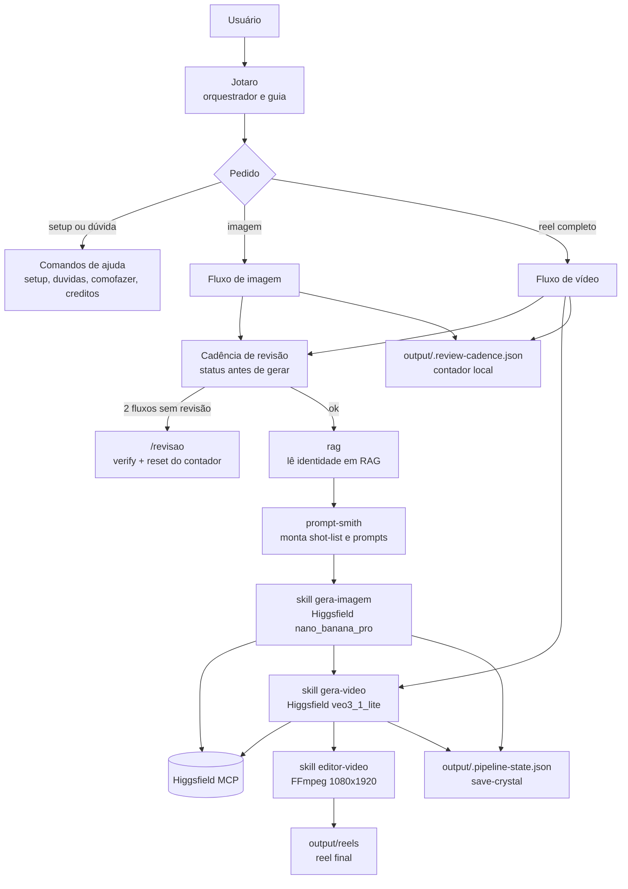

# Trampolean Image and Video Generator

Gera um reel vertical 9:16 (TikTok, Reels, Shorts) com a cara da sua marca, conversando com um
guia chamado Jotaro dentro do Claude Code. Você coloca as imagens da sua marca numa pasta,
pede um vídeo, e sai com o reel montado.

> Geração de imagem e vídeo via **Higgsfield**. Montagem via **FFmpeg**.
> `[uso de IA]` Este produto usa IA para gerar imagens e vídeos.

## Pré-requisitos

1. **Claude Code** instalado, num computador com tela e navegador (a primeira conexão com o
   Higgsfield abre uma página de login no navegador, não funciona em servidor sem interface).
2. **Conta Higgsfield** (o serviço que gera as imagens e vídeos). O plano free dá 10 créditos
   por dia. https://higgsfield.ai
3. **FFmpeg** instalado (monta o reel final). Como instalar está no `/setup`.

## Primeiro uso

1. **Baixe ou clone esta pasta.**
2. **Abra o Claude Code dentro da pasta** (com interface gráfica, não terminal puro). Ao abrir,
   o **Jotaro** já está lá: é o guia com quem você fala.
3. **Rode `/setup`.** Ele conduz a conexão com o Higgsfield (login OAuth no navegador), confere
   o FFmpeg e o saldo. **Depois de conectar o Higgsfield pela primeira vez, reinicie o Claude
   Code**. O serviço só carrega no início da sessão.
4. **Rode `/creditos`** para confirmar que está tudo conectado e ver seu saldo.

Pronto isso uma vez, não precisa repetir. O login fica guardado no seu perfil.

## Onde colocar suas imagens

Coloque de 1 a 3 imagens do seu personagem ou produto em:

```
RAG/identidade-visual/
```

São as imagens de referência: o que mantém a cara igual em todas as cenas. Depois, descreva
sua marca em `RAG/marca.md` e sua história em `RAG/narrativa.md` (há um exemplo pronto lá, o
mago do jogo Trace Defense, troque pelo seu). Detalhes em `RAG/README.md`.

## Como gerar

Você conversa com o Jotaro em português. Exemplos de fala:

- "Jotaro, gere uma imagem do meu personagem atacando um inimigo."
- "Quero um reel de 6 cenas: a vila sob ataque, o herói aparece, a batalha, a vitória."
- "Como troco o personagem do exemplo pelo meu?"

Ou use os comandos diretos:

| Comando | O que faz |
|---------|-----------|
| `/explica-fluxo` | Explica as 4 etapas do gerador. |
| `/setup` | Configuração de primeira vez (Higgsfield, FFmpeg, saldo). |
| `/duvidas` | Tira dúvidas sobre o sistema e os custos. |
| `/comofazer "..."` | How-to guiado para um objetivo específico. |
| `/creditos` | Mostra saldo e plano. Não gasta crédito. |
| `/revisao` | Roda as verificações do produto e zera a cadência de revisão. |
| `/gerarimagem "..."` | Gera uma ou mais imagens de uma cena. |
| `/gerarvideo "..."` | Pipeline completo: imagens, vídeos e reel montado. |

O Jotaro sempre confere o custo antes de gerar e sempre confere se há imagens na pasta de
referência. Você não gasta crédito sem ele avisar.

O Jotaro também mantém uma cadência de revisão: depois de 2 fluxos gerados, ele sugere rodar
`/revisao`; se você tentar gerar um 3º fluxo sem revisar, ele roda a revisão antes de gastar
crédito. Isso evita seguir gerando com hook, permissões ou helpers quebrados.

## Mapa da orquestração



### Equipe e responsabilidades

| Nome | Tipo | O que faz | O que não faz |
|------|------|-----------|---------------|
| **Jotaro** | Orquestrador | Conversa com o usuário, entende o objetivo, aplica escopo, checa custo, chama agentes e skills, registra cadência e entrega o resultado. | Não sai do domínio de imagem/vídeo deste gerador. Não gasta crédito sem avisar. |
| **rag** | Agente folha | Lê `RAG/`, lista referências visuais e devolve identidade: anchor, estilo, paleta, narrativa e tom. | Não gera, não chama Higgsfield, não usa Bash, não spawna agentes. |
| **prompt-smith** | Agente folha | Recebe a identidade do `rag` e transforma o pedido em shot-list com prompts fortes e consistentes. | Não gera imagem, não chama Higgsfield, não consulta o `rag` sozinho. |

### Skills que o Jotaro executa

| Skill | Função |
|-------|--------|
| `higgsfield-preflight` | Lê saldo/plano no Higgsfield e calcula se o run cabe no crédito antes de gerar. |
| `gera-imagem` | Gera imagens 9:16 com referências da marca usando `nano_banana_pro`. |
| `gera-video` | Anima cada imagem em clipe curto usando apenas `veo3_1_lite` no free tier. |
| `editor-video` | Junta os clipes em um reel 1080×1920 com FFmpeg e legenda opcional. |

### Guardrails operacionais

- **Scope-lock:** Jotaro recusa código, opinião, política, texto genérico e jailbreak; ele volta para imagem/vídeo.
- **RBAC:** só o Jotaro age sobre o mundo. `rag` e `prompt-smith` são folhas de leitura/síntese.
- **Save-crystal:** `output/.pipeline-state.json` evita regerar cenas já pagas.
- **Cadência de revisão:** `output/.review-cadence.json` conta fluxos concluídos. Após 2 fluxos, Jotaro sugere `/revisao`; antes do 3º sem revisão, ele roda a revisão obrigatoriamente.

## Custos (honesto)

A geração consome créditos do Higgsfield:

- **Imagem:** 2 créditos.
- **Vídeo** (clipe de 4 segundos, mudo no free): 4 créditos.
- **Reel de 6 cenas:** 6 imagens × 2 + 6 vídeos × 4 = **36 créditos**.

No **plano free** são **10 créditos por dia**, compartilhados entre imagem e vídeo. Então um
reel completo de 6 cenas não cabe num dia só: dá para fazer aos poucos (uns 4 dias) ou assinar
um plano pago para sair de uma vez.

No free, o vídeo usa só o modelo `veo3_1_lite` (4 segundos, 720p, sem som, com marca d'água).
Os outros modelos exigem plano pago. O reel fica mudo até você colocar trilha por fora.

Planos pagos mudam com o tempo; confira os valores atuais direto no Higgsfield antes de
decidir.

## Sobre os pedidos de permissão do Claude Code

Na primeira vez que o Jotaro for montar o reel, o Claude Code vai pedir permissão para rodar o
FFmpeg e para ler a pasta de referências. **Aceite.** Sem isso, o fluxo trava no meio. Não
clique "Negar" por reflexo: são as permissões que o gerador precisa para funcionar.

## Onde ficam os resultados

```
output/imagens/   imagens geradas
output/clips/      clipes de vídeo
output/reels/      o reel final montado (reel-<data-hora>.mp4)
```

O contador local da cadência fica em `output/.review-cadence.json` e não é versionado.

## Quer ver antes de gerar

A pasta `examples/` traz um reel pronto (o mago do Trace Defense) e uma imagem de exemplo. É a
prova de que funciona, antes de você gastar o primeiro crédito.

## Problemas comuns

- **"FFmpeg não encontrado"**: Não está instalado ou não está no PATH. Rode `/setup` (Passo
  2) para ver o comando de instalação do seu sistema. No Windows: `winget install Gyan.FFmpeg`.
- **"As ferramentas do Higgsfield não aparecem"**: Você conectou mas não reiniciou. Feche e
  abra o Claude Code de novo: o serviço só carrega no início da sessão.
- **"Erro de autenticação no meio do fluxo"**: O login do Higgsfield expirou. Rode `/setup` a
  partir do Passo 1 para reconectar e reinicie o Claude Code.
- **"Crédito insuficiente"**: O reel não cabe no saldo de hoje. Faça por partes (o Jotaro
  retoma de onde parou no dia seguinte) ou assine um plano pago.
- **"O vídeo está sem som"**: Normal no free: o `veo3_1_lite` gera clipe mudo. Coloque trilha
  por fora se quiser.
